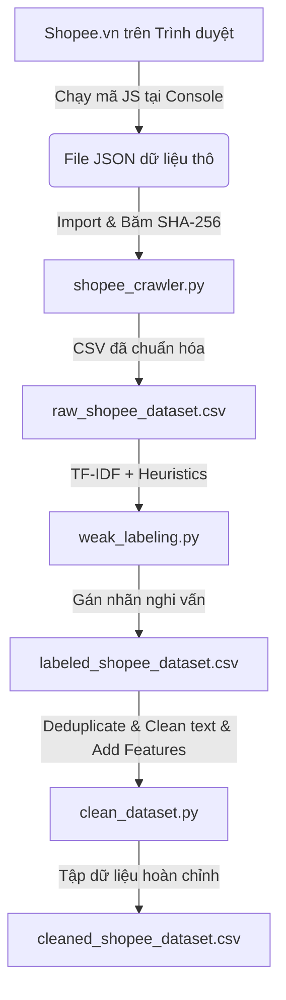

# Báo Cáo Hệ Thống Thu Thập, Gán Nhãn Yếu Và Làm Sạch Đánh Giá Shopee
## Nghiên Cứu Phát Hiện Đánh Giá Giả Mạo (Fake Review Detection)

---

## 1. Mục tiêu Đề tài
Xây dựng một đường ống (pipeline) thu thập, gán nhãn yếu (Weak Labeling) và làm sạch dữ liệu tự động từ các đánh giá công khai trên nền tảng thương mại điện tử Shopee. Tập dữ liệu đầu ra được tối ưu hóa để sẵn sàng đưa trực tiếp vào huấn luyện và đánh giá các mô hình học máy phát hiện đánh giá giả mạo (Fake Review/Seeding Detection).

---

## 2. Kiến trúc Hệ thống & Quy trình Xử lý Dữ liệu

Hệ thống bao gồm ba giai đoạn chính được liên kết chặt chẽ:

1. **Giai đoạn 1: Thu thập & Ẩn danh hóa dữ liệu (`shopee_crawler.py`)**: 
   - Sử dụng tệp JSON thô xuất ra từ trình duyệt (giúp vượt qua lớp chặn WAF của Shopee).
   - Hệ thống tự động băm (hash) tên người dùng thành chuỗi SHA-256 để bảo vệ quyền riêng tư cá nhân (Anonymization).
   - Xuất ra file dữ liệu thô `raw_shopee_dataset.csv`.

2. **Giai đoạn 2: Gán nhãn yếu (`weak_labeling.py`)**:
   - Áp dụng 4 Heuristics (Đánh giá ngắn 5 sao H1, Trùng lặp nội dung H2, Đột biến thời gian H3, Từ khóa rác H4) để tự động xác định nhãn đáng ngờ `is_suspicious`.
   - Xuất ra file gán nhãn `labeled_shopee_dataset.csv`.

3. **Giai đoạn 3: Làm sạch & Kỹ nghệ đặc trưng (`clean_dataset.py`)**:
   - Loại bỏ các dòng trùng lặp tuyệt đối (crawling duplicates).
   - Loại bỏ các đánh giá bị thiếu (null) nội dung.
   - **Chuẩn hóa chuỗi văn bản**: Thay thế các ký tự xuống dòng (`\n`, `\r`) bằng dấu cách và xóa khoảng trắng thừa, giúp mỗi đánh giá nằm trọn vẹn trên 1 dòng của tệp CSV, tránh lỗi phân tách khi nạp dữ liệu vào PyTorch/HuggingFace.
   - Điền khuyết các giá trị thiếu khác (ví dụ: gán mặc định `image_count` = 0).
   - **Kỹ nghệ đặc trưng (Feature Engineering)**: Thêm các cột bổ trợ phục vụ mô hình học máy: Độ dài ký tự (`char_length`) và số lượng từ (`word_count`).
   - Xuất ra tệp dữ liệu sạch hoàn chỉnh `cleaned_shopee_dataset.csv`.

---

## 3. Quy trình Gán nhãn yếu (Weak Labeling Heuristics)

| Heuristic | Tên gọi | Logic kiểm tra | Mục đích phát hiện |
| :--- | :--- | :--- | :--- |
| **H1** | Short Review with High Rating | Đánh giá 5 sao nhưng nội dung văn bản dưới 10 từ (sau khi tách từ bằng thư viện `underthesea`). | Các đánh giá lười, seeding tự động chỉ để lấy sao. |
| **H2** | Duplicate Detection | Biến đổi văn bản bằng TF-IDF và tính **Cosine Similarity** giữa các đánh giá. Flag nếu độ tương đồng > 90%. | Seeding sao chép hàng loạt nội dung mẫu có sẵn. |
| **H3** | Burst Detection | Phát hiện tần suất gửi đánh giá vượt quá 10 đánh giá trong cùng 1 giờ trên cùng 1 sản phẩm. | Chiến dịch seeding cấp tốc hoặc spam đột biến. |
| **H4** | Semantic Mismatch / Spam | Sử dụng Biểu thức chính quy (Regex) quét các từ khóa rác kiếm xu ("farm xu", "nhận xu") hoặc ký tự rác lặp (gibberish). | Đánh giá vô nghĩa, không liên quan đến sản phẩm để lấp đầy ký tự. |

---

## 4. Kết quả Thực nghiệm trên Sản phẩm mẫu
Thực hiện trên sản phẩm có mã **Shop ID: `24710134`** và **Item ID: `10280321597`** (Thời trang/Áo thun thể thao):

### Thống kê sau khi Làm sạch (Cleaning Results)
- **Số lượng mẫu ban đầu**: 500 đánh giá.
- **Loại bỏ đánh giá rỗng (null comment)**: 2 mẫu.
- **Số lượng mẫu sạch cuối cùng**: 498 mẫu.
- **Tổng số mẫu bị gắn nhãn nghi vấn (`is_suspicious` = 1)**: 33 mẫu (tỷ lệ **6.63%**).

### Kiểm định Chất lượng Dữ liệu Sạch (Validation Status)
- **Giá trị khuyết thiếu (Null/NaN)**: 0 (đã giải quyết triệt để trên tất cả các cột).
- **Trùng lặp dòng (Row duplicates)**: 0 (đã xóa toàn bộ).
- **Cấu trúc dữ liệu**: Được chuẩn hóa thành cấu trúc dạng bảng phẳng một dòng tiện dụng cho phát triển hệ thống.

---

## 5. Kết luận & Hướng phát triển
- **Đạt được**: Hệ thống xây dựng hoàn chỉnh chu trình từ thu thập, ẩn danh, gán nhãn đến làm sạch dữ liệu.
- **Ứng dụng**: Tập dữ liệu sạch `cleaned_shopee_dataset.csv` đã sẵn sàng để huấn luyện trực tiếp các mô hình phân loại (SVM, Naive Bayes) hoặc các mô hình ngôn ngữ lớn (BERT/RoBERTa) phục vụ nghiên cứu.
