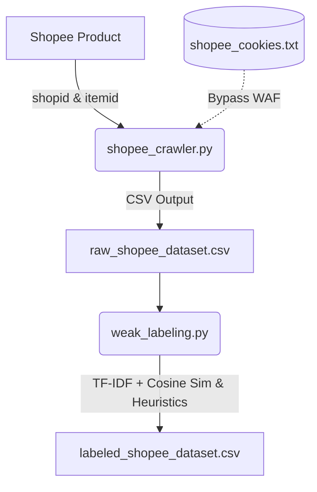

# Shopee Crawler & Heuristic Weak Labeling Pipeline

Tài liệu này hướng dẫn cách chạy và giải thích kiến trúc của hệ thống thu thập đánh giá sản phẩm Shopee và gán nhãn yếu phục vụ cho mục đích nghiên cứu phát hiện đánh giá giả mạo (Fake Review Detection).

---

## 1. Kiến trúc Hệ thống

Hệ thống bao gồm hai thành phần chính:
1.  **Shopee Crawler (`shopee_crawler.py`)**: Tải trực tiếp đánh giá sản phẩm từ API công khai của Shopee (`/api/v2/item/get_ratings`) dưới dạng các yêu cầu HTTP đơn giản, có giới hạn tần suất gửi yêu cầu (`time.sleep(3)`) và ẩn danh hóa thông tin người dùng ngay lập tức.
2.  **Weak Labeling Engine (`weak_labeling.py`)**: Đọc dữ liệu thô, áp dụng các heuristics (luật tự động) dựa trên độ dài văn bản, độ trùng lặp nội dung (Cosine Similarity), tần suất đột biến theo thời gian (Burst), và từ khóa rác (Semantic Mismatch) để đánh dấu nhãn `is_suspicious` (nghi vấn).



---

## 2. Hướng dẫn cài đặt thư viện

Đảm bảo bạn đã cài đặt các thư viện cần thiết bằng lệnh:
```bash
pip install -r requirements.txt
```
Nếu chưa có tệp `requirements.txt` hoặc thiếu thư viện, hãy cài đặt trực tiếp:
```bash
pip install requests pandas scikit-learn underthesea
```

---

## 3. Cách vượt qua hệ thống chặn Bot (Error 403 / 90309999) của Shopee

Shopee cấu hình Web Application Firewall (WAF) cực kỳ nghiêm ngặt. Khi bạn gửi yêu cầu không có cookie hợp lệ bằng Python, Shopee sẽ trả về mã lỗi `403 Forbidden` hoặc mã lỗi nội bộ `90309999`. 

Để vượt qua bộ lọc này, hệ thống cung cấp 2 giải pháp:

### Giải pháp A: Nhúng cookie vào Crawler (Chạy trực tiếp trên Python)
1.  **Mở trình duyệt** (Chrome/Firefox/Edge) và truy cập vào [shopee.vn](https://shopee.vn).
2.  **Đăng nhập tài khoản** của bạn.
3.  **Nhấn phím F12** để mở Developer Tools, chọn tab **Network** (Mạng).
4.  F5 tải lại trang, click chọn yêu cầu bất kỳ gửi đến `shopee.vn`.
5.  Xem mục **Request Headers**, tìm dòng `Cookie` và **sao chép toàn bộ giá trị** của nó.
6.  Tạo tệp **`shopee_cookies.txt`** nằm trong cùng thư mục với `shopee_crawler.py`, dán chuỗi cookie vào và lưu lại.

### Giải pháp B: Chạy JavaScript xuất file JSON từ Trình duyệt (Khuyên dùng khi WAF chặn quá chặt)
Nếu Shopee quét cả vân tay SSL (JA3/JA4) và chặn Python kể cả khi có Cookie, bạn có thể thực hiện tải dữ liệu trực tiếp bằng phiên trình duyệt thật đã xác minh:
1. Mở trang sản phẩm Shopee trên trình duyệt của bạn.
2. Nhấn **F12**, chuyển sang tab **Console**.
3. Dán đoạn mã dưới đây vào Console và nhấn **Enter** (thay thế `24710134` và `10280321597` bằng `shopid` và `itemid` của bạn, số `500` là lượng review cần cào):
   ```javascript
   async function downloadShopeeReviews(shopid, itemid, targetCount) {
       let allRatings = [];
       let offset = 0;
       const limit = 50;
       console.log("Bắt đầu tải đánh giá...");
       while (allRatings.length < targetCount) {
           console.log(`Đang tải offset ${offset}...`);
           const url = `https://shopee.vn/api/v2/item/get_ratings?filter=0&flag=1&limit=${limit}&offset=${offset}&type=5&exclude_filter=1&filter_size=0&fold_filter=0&relevant_reviews=false&request_source=2&tag_filter=&variation_filters=&need_translation=1&shopid=${shopid}&itemid=${itemid}&fe_toggle=%5B2%2C3%5D&preferred_item_shop_id=${shopid}&preferred_item_item_id=${itemid}&preferred_item_include_type=1`;
           try {
               const res = await fetch(url);
               if (!res.ok) { console.error(`Lỗi HTTP: ${res.status}`); break; }
               const data = await res.json();
               const ratings = data?.data?.ratings || [];
               if (ratings.length === 0) { console.log("Đã hết đánh giá."); break; }
               allRatings = allRatings.concat(ratings);
               offset += ratings.length;
               console.log(`Đã tải được ${allRatings.length} đánh giá.`);
               await new Promise(r => setTimeout(r, 3000));
           } catch (e) { console.error("Lỗi:", e); break; }
       }
       const blob = new Blob([JSON.stringify(allRatings, null, 2)], { type: 'application/json' });
       const a = document.createElement('a');
       a.href = URL.createObjectURL(blob);
       a.download = `shopee_reviews_${shopid}_${itemid}.json`;
       document.body.appendChild(a);
       a.click();
       document.body.removeChild(a);
       console.log("Xong! File JSON đã được tải xuống máy.");
   }
   downloadShopeeReviews(24710134, 10280321597, 500);
   ```
4. Lưu file JSON vừa tải xuống vào thư mục chứa code `vietnamese_fake_reviews`.
5. Chạy lệnh import trong Python để tự động băm ẩn danh dữ liệu và chuyển đổi thành tập dữ liệu chuẩn:
   ```bash
   python shopee_crawler.py --import_json shopee_reviews_24710134_10280321597.json
   ```

---

## 4. Hướng dẫn sử dụng Crawler (`shopee_crawler.py`)

Chạy script qua command line với các tham số:
*   `--shopid`: ID của Shop chứa sản phẩm cần cào dữ liệu.
*   `--itemid`: ID của Sản phẩm cần cào dữ liệu.
*   `--limit`: Số lượng đánh giá tối đa muốn thu thập (mặc định là 50).

**Ví dụ lấy dữ liệu từ một sản phẩm bất kỳ:**
Giả sử link sản phẩm là: `https://shopee.vn/Apple-iPhone-13-128GB-i.88201679.10753341705`
*   `shopid` = `88201679`
*   `itemid` = `10753341705`

Chạy lệnh sau:
```bash
python shopee_crawler.py --shopid 88201679 --itemid 10753341705 --limit 100
```

Kết quả thu thập sẽ được ghi nhận vào tệp **`raw_shopee_dataset.csv`** với các trường:
*   `user_id`: Định danh người dùng đã được băm SHA-256 (Anonymized).
*   `comment`: Nội dung đánh giá của khách hàng.
*   `rating`: Số sao đánh giá (1-5).
*   `timestamp`: Thời gian đánh giá dạng `YYYY-MM-DD HH:MM:SS`.
*   `image_count`: Số lượng hình ảnh người dùng đính kèm.
*   `is_purchased`: Xác định trạng thái đã mua hàng (mặc định `True`).

---

## 5. Hướng dẫn sử dụng Bộ gán nhãn yếu (`weak_labeling.py`)

Bộ gán nhãn yếu xử lý tệp CSV thô được cào về, áp dụng 4 Heuristics để xác định hành vi bất thường và lưu lại kết quả.

Chạy lệnh sau:
```bash
python weak_labeling.py --input raw_shopee_dataset.csv --output labeled_shopee_dataset.csv
```

### Các Heuristics được sử dụng:
1.  **Short Review with High Rating (H1)**: Đánh giá có rating tối đa (5 sao) nhưng nội dung rất ngắn (ít hơn 10 từ tiếng Việt sau khi dùng `underthesea` tách từ).
2.  **Duplicate Detection (H2)**: Sử dụng TF-IDF để vectơ hóa văn bản và tính **Cosine Similarity** giữa các đánh giá trong cùng tập dữ liệu. Các đánh giá có độ tương đồng với nhau trên 90% sẽ bị gán nhãn trùng lặp (ví dụ: seeding sao chép hàng loạt).
3.  **Burst Detection (H3)**: Phát hiện tần suất gửi đánh giá đột biến theo giờ (nhiều hơn 10 đánh giá cho cùng sản phẩm trong cùng một giờ).
4.  **Semantic Mismatch (H4)**: Phát hiện nội dung rác, không liên quan đến sản phẩm như:
    *   Các cụm từ xin xu, cày xu: *"farm xu", "nhận xu", "hình ảnh mang tính chất nhận xu"*...
    *   Lời bài hát hoặc công thức nấu ăn được copy để lấp đầy ký tự.
    *   Ký tự rác lặp vô nghĩa (gibberish): *"aaaaaa", "qwertyuiop", "ahsdgajshd"*...

**Kết quả đầu ra (`labeled_shopee_dataset.csv`)**:
Tệp đầu ra chứa toàn bộ dữ liệu thô và được bổ sung thêm các cột:
*   `h1_content`, `h2_duplicate`, `h3_burst`, `h4_semantic`: Các giá trị nhị phân `0`/`1` tương ứng với kết quả của từng heuristic.
*   `is_suspicious`: Nhãn yếu (`0`: Bình thường, `1`: Đáng ngờ) được tính bằng phép toán logic `OR` từ 4 heuristics trên. Nhãn này đóng vai trò làm thước đo kiểm định (validation target) cho mô hình học máy.
